

KVNProgress is a fully customizable progress HUD that can be full screen or not. It is forked from [kevin-hirsch-KVNProgress](https://github.com/kevin-hirsch/KVNProgress) and we added Carthage support.
***

## Preview

Base interface: 

[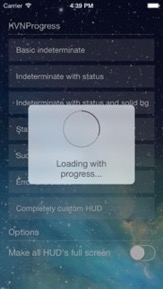](Images/screenshot_003.jpg)
[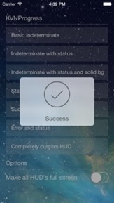](Images/screenshot_004.jpg)
[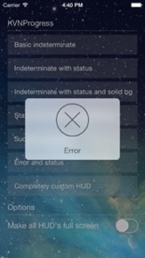](Images/screenshot_005.jpg)
 
Full screen interface: 
[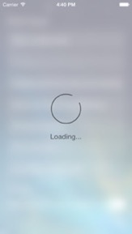](Images/screenshot_007.jpg)
[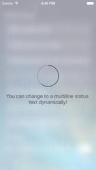](Images/screenshot_008.jpg)
[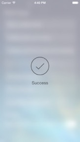](Images/screenshot_009.jpg)
[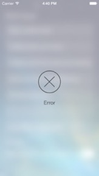](Images/screenshot_010.jpg)
 
Example of customized interface: 
[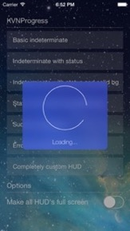](Images/screenshot_013.jpg)
[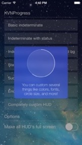](Images/screenshot_006.jpg)
[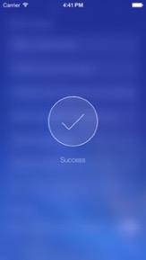](Images/screenshot_011.jpg)
[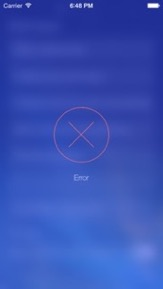](Images/screenshot_012.jpg)

## Advantages

 * [x] Can be full screen
 * [x] Uses `UIMotionEffect`
 * [x] Supports all orientations
 * [x] Supports iPad
 * [x] Animates text update
 * [x] Animates success checkmark
 * [x] Is well documented
 * [x] Is fully customizable
    * Colors
    * Fonts
    * Circle size and thickness
    * Blur or solid color background

## Demo

Here is a video of the demo app that you can find in this project.
If you want to try it yourself, just download/checkout this repository and launch the project in Xcode.

[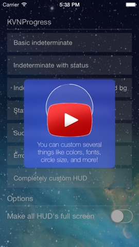](https://www.youtube.com/watch?v=aerOmPYG_NI)

## Installation

### Carthage

[Carthage](https://github.com/Carthage/Carthage) recommended to use KVNProgressCF.

1. Add "github "Hendrik44/KVNProgressCF" ~> 2.2.4" to your cartfile
2. Add Framework in your Xcode-Project
3. Import it, when needed

## Docs
The full documentation you can find here [https://github.com/kevin-hirsch/KVNProgress](https://github.com/kevin-hirsch/KVNProgress)

## Bugs
Please report bugs first to the original repository [https://github.com/kevin-hirsch/KVNProgress/issues](https://github.com/kevin-hirsch/KVNProgress/issues), then create issue here and i will fix it.

## Requirements

* Xcode 6
* iOS 8
* ARC

## License

This project is under MIT license. For more information, see `LICENSE` file.

## Credits

KVNProgress was forked from [Kevin Hirsch](https://github.com/kevin-hirsch/KVNProgress).

Enjoy! :)
